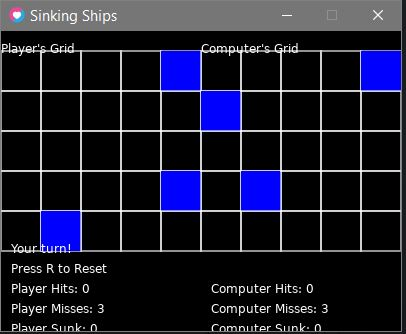

# Sinking Ships - README

## Overview
"Sinking Ships" is a simple 2D battleship-style game built using the LÖVE framework. The objective of the game is to place ships on a grid, and then take turns with the computer to attack each other's grids until all ships of one player are sunk.

## How to Play
1. **Start the Game:** Run the game, and you will be prompted to place your ships on your grid.
2. **Place Ships:** Click on your grid to place your ships. Use the spacebar to rotate the ship orientation between horizontal and vertical.
3. **Begin Attacks:** Once all ships are placed, the game state switches to playing mode. Click on the computer's grid to attack.
4. **Computer Turn:** After each of your turns, the computer will automatically take its turn to attack your grid.
5. **Winning or Losing:** The game ends when all ships of either the player or the computer are sunk. A message will display if you won or lost.
6. **Reset Game:** Press "R" to reset the game at any time.

## Controls
- **Mouse Click:** Place ships on your grid or attack cells on the computer's grid.
- **Spacebar:** Rotate the ship orientation during placement.
- **R Key:** Reset the game and start over.

## How to run
- make sure you have Love2D installed
- download the repo files
- open the main.py file in a code editor
- run the file

